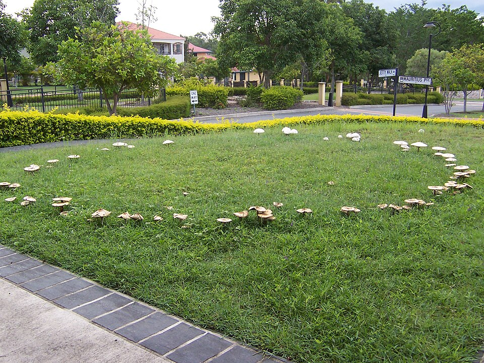
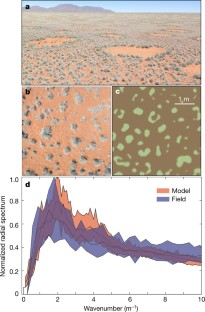
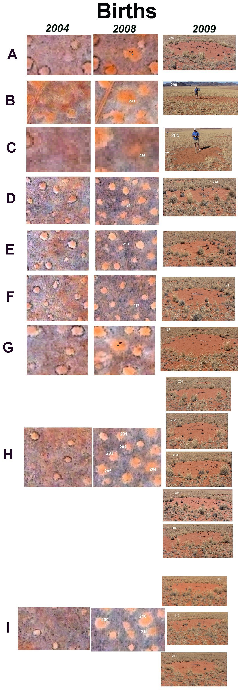
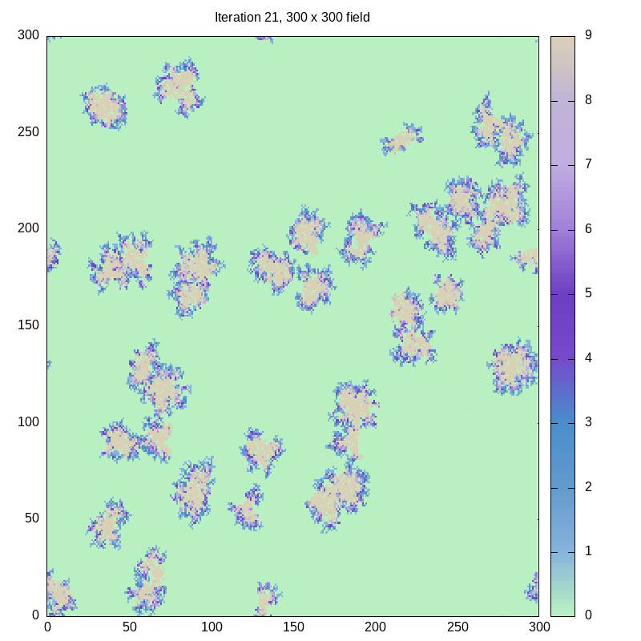
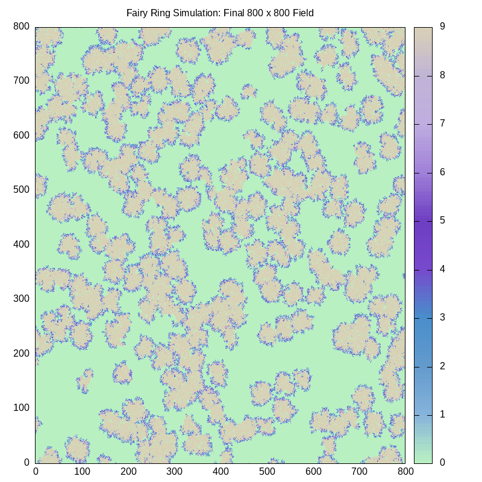
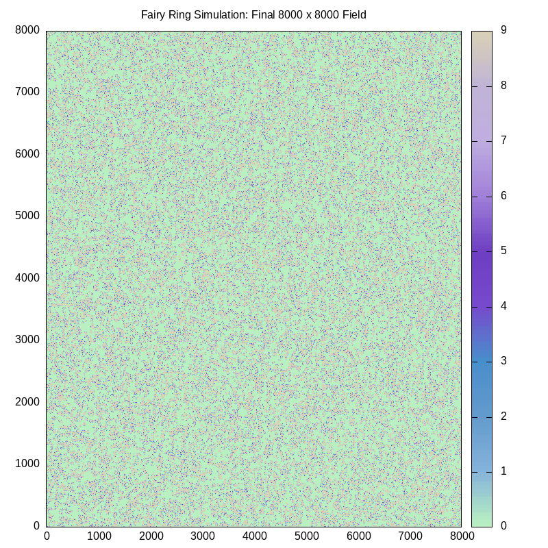

# Mushroom Fairy Rings Simulation

Libby Shoop, Macalester College

### Prerequisite activities
There are several activities you can complete before this assignment that will help you finish this one.
 Some practice using parallel for loops in OpenMP (see [Chapter 2 of the Intermediate PDC](https://www.learnpdc.org/IntermediatePDC/2-SharedMemoryPatternlets/toctree.html) online textbook)
- Practice with random number libraries such as the C++ random library or the parallel `trng` library (for trng, see [Chapter 3 of the Intermediate PDC](https://www.learnpdc.org/IntermediatePDC/3-RandomPatterns/toctree.html) online textbook)
- Some instruction or activity for strong and weak scalability and depicting it with graphs. This repository provides such an activity, including how to use a pre-formatted Google sheet to graph strong and weak scalability: https://github.com/csinparallel/CSinParallel/tree/main/Exemplars/TrapezoidIntegrationScaling 
- Game of Life OpenMP versions are a prerequisite in-class activity. Code similar to this assignment can be found here:  
	 https://github.com/csinparallel/CSinParallel/tree/main/Exemplars/StochasticGameOfLife

	Note how the organization of the code is very much the same, because the Game of Life is a structured grid problem that uses a stencil, just as this one does (see below). These two together show this type of pattern: very similar code that makes up the bulk of the application.

- (Useful but not strictly required) a linux machine with gnuplot installed
- (Optional if choose trng version) Chapter 3 in Intermediate PDC book
- (Optional if use cpp random library) Read docs about C++ random library use.

### Introduction to problem

This assignment is inspired by a project described in this book:

Shiflet, A. B., & Shiflet, G. W. (2014). _Introduction to computational science: modeling and simulation for the sciences_. Princeton University Press. pp 711-719

These authors describe an interesting biological phenomena that can be modeled computationally using a pattern called a *structured grid*. This phenomenon is the growth of fungi such as mushrooms along the ground, where the visible part of the fungi form a ring (Figure 1 below). This growth pattern has taken on many names and been the subject of folklore; the most common name is Mushroom Fairy Rings. Imagine the yard shown in Figure 1 as a rectangular grid of space separated into small pieces, or cells. We can model how the fungi grow from a single seed called a spore to form such a ring over time. These types of rings are found in many locations throughout the world.




Figure 1.Mushroom Fairy ring on a lawn in Brisbane, Australia. Attribution: By User:Mrs skippy - Own work, Public Domain, https://commons.wikimedia.org/w/index.php?curid=3352618

These patterns can occur in huge numbers across wide stretches of land throughout the world. Tarnita, et al. (2017) describe how these "self-organized regular vegetation patterns" have now been verified by satellite imagery and can be explained theoretically.[^1] Figure 4 of this paper, reproduced Here as Figure 2, shows a wide view of these patterns formed in grasses, a satellite view, and the results of a computational model built to mimic them.



Figure 2. Figure 4 from Tarnita, C., Bonachela, J., Sheffer, E. _et al._ A theoretical foundation for multi-scale regular vegetation patterns. _Nature_ **541**, 398–401 (2017). https://doi.org/10.1038/nature20801.

To provide some additional perspective of time for these grassland patterns, Walter Tschinkel described The life cycle and life span of Fairy circles in the grasslands of Namibia over a period of 4 years [^2]. Figure 4 of this paper, reproduced here as Figure 3, depicts satellite images between 2004 and 2008 and what one individual circle looked like in 2009. From this work they could estimate an overall lifespan for these particular patterns: "Lifespan appeared to vary with circle size, with small circles averaging about 24 years, and larger ones 43–75 years. Overall lifespan averaged about 41 yr." This is a fascinating open source article about these particular formations in the grasslands of Africa.




Figure 3. Figure 4 from Tschinkel WR (2012) The Life Cycle and Life Span of Namibian Fairy Circles. PLOS ONE 7(6): e38056. [https://doi.org/10.1371/journal.pone.0038056](https://doi.org/10.1371/journal.pone.0038056)

**How does this happen?** 

The grass fairy circles appear to form as the plants use up available water and form the barren circle, but are later replenished by water that falls within the circle [^3] In this assignment, we will focus on the many species of fairy ring forming fungi and modeling how the rings form. While mushrooms are the most recognizable common fungi, there are many other types. Like the grasses, these can range from several to hundreds of feet in diameter, grow abundantly, and live for many years.

Fungi are organisms that produce spores as their mechanism of reproduction: each spore can germinate into a new fungus. The fungi rely on nutrients in the ground around them to grow. Each fungus sprouts small threads underground called mycelium, which grow outward in a circular pattern. Some fungi are invisible or not easily seen as they grow at the ends of the mycelium. The mushroom structure that we are most familiar with is formed by the organized growth of **hyphae** from the mycelium. The mushroom's hyphae eventually become spore bearing, causing the growth of more mushrooms in a circular pattern. This radial form of growth enables the mushrooms to grow into new areas searching for nutrients, leaving the inside of the circles without nutrients, or **inert**. Hyphae in the center of the forming circles decay and die out; those on the outside form irregular rings. Under the right conditions, these rings can continue to grow for long periods of time.

### How do we model it computationally?

The basic principle behind creating a computational model for this phenomenon is the same as that for a cellular automata such as the famous Conway's game of Life. We model the ground as a 2D grid of cells (a **structured grid**) that contain spores. We examine each cell during several iterations that mimic the marching of time. The cells have values based on the state of the mushroom at the time of the iteration (how much time each iteration represents is not important). In the classic game of life by mathematician John Conway, cells have 2 states: alive or dead. In this simulation, cells have more states, which we will give these values (from [^1]):

| **name**  | **value** | **description**                                 |
| --------- | --------- | ----------------------------------------------- |
| EMPTY     | 0         | Empty ground                                    |
| SPORE     | 1         | Containing a spore                              |
| YOUNG     | 2         | Young hyphae that haven't formed mushrooms yet  |
| MATURING  | 3         | Maturing hyphae; still haven't formed mushrooms |
| MUSHROOMS | 4         | Older hyphae with mushrooms                     |
| OLDER     | 5         | Older hyphae with no mushrooms                  |
| DECAYING  | 6         | Decaying hyphae with exhausted nutrients        |
| DEAD1     | 7         | Newly dead hyphae                               |
| DEAD2     | 8         | Hyphae that have been dead for a while          |
| INERT     | 9         | Area where plants cannot grow                   |

Like the classic Game of Life, the eight cells around a cell, called the *neighborhood*, are examined to determine  whether an EMPTY cell could become a SPORE because a neighboring cell is a spore. Use of this neighborhood of cells is called a **stencil pattern**. Cells going from SPORE to YOUNG to MATURING and so on through the states are determined by other rules. The difference between this mushroom fairy ring model and the game of life is that *we introduce probabilities for the chance of a cell to go from one sate to another in some cases*.

We use 2 grids of cells, one to represent the current state, and one to represent the next state after applying the rules during an iteration. The original grid is initialized to some state (details below). After the new grid values are computed, the the new grid is copied to the original grid for the next iteration, and the rules are applied again. This use of 2 grids during this type of simulation is quite common and is called **double buffering**. Here are the rules that are applied at each iteration (see the apply_rules.cpp file for implementation):

- If EMPTY and one neighbor is a spore, the cell becomes a SPORE with probability PROB_SPREAD.
- if SPORE, it becomes YOUNG with probability PROB_SPORE_TO_HYPHAE.
- if YOUNG, it becomes MATURING.
- If MATURING, it becomes MUSHROOM with probability PROB_MUSHROOM, otherwise goes to OLDER.
- If MUSHROOM or OLDER, it becomes DECAYING.
- If DECAYING, it becomes DEAD1.
- If DEAD1, it becomes DEAD2.
- If DEAD2, it becomes INERT.
- Once INERT, it stays that way.

This type of computation requires the generation of a random number per cell that will be compared to the probabilities designed for the simulation. This means that this type of computation is a **Monte Carlo Simulation**.

Because of the double buffering using 2 grids, this type of simulation can be parallelized so that each cell value for the new grid can be computed by a different thread or processing unit in parallel. The old grid is read but not updated, so it can be shared by all threads or processing units.

### Key Parallel Patterns in this example

This code is an example of parallel structured grid **computational pattern** using a neighborhood stencil and Monte Carlo simulation. This type of parallel computational pattern for a simulation is described in https://patterns.eecs.berkeley.edu/?page_id=498, which shows the stencil concept and describes "double buffering". Parallel Monte Carlo methods are described in  https://patterns.eecs.berkeley.edu/?page_id=186. It is left as an exercise for you to determine the other parallel patterns found in this example.

### Code you can work on

The sequential versions of this code work- don't touch them, rather use them as the working version that you can use to verify that your parallel version is behaving properly. There are several versions of the sequential code that you can make. Each is designed to use a single OpenMP thread and varies by the random number generation library that you have available.

- one for standard C++ random library
- one for the C++  trng library

As we will see below, the trng library creates a true stream of random numbers over each iteration of the simulation, so that with a given constant seed, the results are repeatable. This is not the case for the standard C++ random library, though in some cases it likely creates reasonable simulations overall, just not ones we can replicate over multiple iterations using a particular starting seed.

In this assignment, you will implement an OpenMP version with one of these two 2 random number generator libraries, or both. Check with your instructor.

### Directory and File structure

This code is highly decomposed so that each file is small and devoted to a specific purpose. This should make it easier to concentrate on a specific part of the code as you add changes.

The directories in this repository are as follows:

| Directory             | Purpose                                                                                                                          |
| --------------------- | -------------------------------------------------------------------------------------------------------------------------------- |
| ./command_line/       | Code for command line argument handling                                                                                          |
| ./docs_images/        | Images used in this README doc                                                                                                   |
| ./graphics/           | Code for displaying graphical image of grid (uses gnuplot)                                                                       |
| ./grid_omp_rand_cpp/  | OpenMP version of the grid functions that you will work on if you are using C++ random numbers                                   |
| ./grid_omp_rand_trng/ | OpenMP version of the grid functions that you will work on if you are using the trng random number library (requires an install) |
| ./grid_seq_rand_cpp/  | Sequential version of the grid functions if you are using C++ random numbers- DO NOT CHANGE (for reference)                      |
| ./grid_seq_rand_trng/ | Sequential version of the grid functions if you are using the trng random number library                                         |
| ./movie_images/       | This is where images will be stored that can be used to create an mpeg movie                                                     |
| ./object_files/       | This is where the code in the commandline and graphics folders gets compiled into object files                                   |
Here is an explanation of the code files within the above directories and in this directory:

| Code File                                   | Description                                                                                         |
| ------------------------------------------- | --------------------------------------------------------------------------------------------------- |
| command_line/getCommandLine.cpp             | Handle command line argument flags                                                                  |
| grid_omp_rand_cpp/cpprandom_calcNewGrid.cpp | OpenMP function called each iteration using C++ random library                                      |
| grid_omp_rand_cpp/cpprandom_initGrid.cpp    | OpenMP function called once to initialize the grid with random spores using C++ random library      |
| grid_omp_rand_trng/trng_calcNewGrid.cpp     | OpenMP function called each iteration using trng random library                                     |
| grid_omp_rand_trng/trng_initGrid.cpp        | OpenMP function called once to initialize the grid with random spores using trng random library     |
| grid_seq_rand_cpp/cpprandom_calcNewGrid.cpp | Sequential function called each iteration using C++ random library                                  |
| grid_seq_rand_cpp/cpprandom_initGrid.cpp    | Sequential function called once to initialize the grid with random spores using C++ random library  |
| grid_seq_rand_trng/trng_calcNewGrid.cpp     | Sequential function called each iteration using trng random library                                 |
| grid_seq_rand_trng/trng_initGrid.cpp        | Sequential function called once to initialize the grid with random spores using trng random library |
| grid_common.cpp                             | Functions printGrid and prdat used in all  versions of the program                                  |
| mushroom_omp.cpp                            | OpenMP version containing main() that you will work on                                              |
| mushroom_rules.cpp                          | The apply_rules function that encodes the rules described above                                     |
| mushroom_seq.cpp                            | Sequential version containing main(). DO NOT CHANGE- Use for reference and profiling.               |

### The executables

Please look at the Makefile to see the following lines:

```
PROGS = cpprand_mushroom_omp cpprand_mushroom_seq cpprand_mushroom_seq_prof
PROGS_TRNG = trng_mushroom_omp trng_mushroom_seq

all: $(PROGS) $(PROGS_TRNG)
```

The PROGS are executables that will build using the files devoted to the C++ random library listed above. The  PROGS_TRNG are the executables that will build using the files given for the trng random number library listed above.


 If you do not have the trng random number generation library installed on the machine where you are building this code, you will need to comment out the trng-based executables in the 'all' line like this:

```
all: $(PROGS) #$(PROGS_TRNG)
```

### What to work on

The code files tagged with 'omp' in their names are ones that you can choose to work on. For now they are duplicates of the ones tagged 'seq'. For the assignment, you will profile the sequential version of the code to help you decide priority order of the updates that you will make.

The code files in the graphics directory should not need to be touched unless you work on some of the 'challenge' activities for this assignment.

The code file in the `commandline` directory will be changed to make gathering experimental data easier. Work on the correct OpenMP, ('omp' tagged files) versions first.

The file `mushroom_common.cpp` should not need to be changed.

The file `mushroom_rules.cpp` should not change unless you want to experiment with changing the probabilities to see how it affects the behavior of the simulation.
### Using the sequential version to see how it works and profile

The Makefile should build all versions by simply typing

		make

We'll start by working with the sequential version to see how the program works and what the purpose of the various command-line arguments is. We will use the sequential version that uses the C++ random number library, since you should have that installed on your machine. First try this to see what the command line arguments are:

```
./cpprand_mushroom_seq -h
```

The results are this 'usage' text:

```
Usage: ./cpprand_mushroom_seq [-m dim] [-i iterations] [-t numThreads] [-d] [-v] [-a]
  -w dim         : width of the grid (default: 2048)
  -l dim         : vertical length of the grid (default: 2048)
  -i iterations  : number of iterations (default: 1024)
  -t numThreads  : number of threads to use (default: 1)
  -d             : debug mode (default: off)
  -g             : graphics mode for depicting grids (default: off)
  -a             : enable animation (default: off)
  -m             : create movie images (default: off)
  -c             : center spore (default: off)
  -h             : display this help message
```

In the case of the sequential version, we've forced the number of threads to be 1; the -t option only applies to the OpenMP version that you will work on.

The -d option is used to test whether the results are the same when repeated. In this 'debug' mode, the random number generator is initiated with a fixed seed. You can find this near line 76 of the file `mushroom_seq.cpp`.

The -c option is also used for debugging: it creates only one spore near the center of the grid.

The -g, -a, and -m options require the linux plotting package called gnuplot to be installed.

If you don't have a linux machine with gnuplot installed, you can still get some information from textual screen output when debugging your program. If you use a small grid whose width is <= 8 in debug mode, the initial values, values during each iteration, and the final values will be printed to your screen. Use a small number of iterations, like this:
```
./cpprand_mushroom_seq -i 4 -w 8 -l 8 -c -d
```
The -c option is necessary here because with such a small test-sized grid, we would like one spore in the middle (also there may be no spores because of the low probability of a spore being placed in a cell in the initial grid).

What you should see from this above example is that after 4 iterations some cells have the value 4 (MUSHROOM), but none have gotten to 9 (INERT) where the nutrients are used up. Another piece of information that is provided for debugging purposes is the total number of non-zero cells, which is given like this:

		Total: 17

The initial state of the grid is saved in a file called `initial.dat` and the final state of the grid is saved in `final.dat`. Look at those file to see that they match what was printed out. Now you can try a slightly bigger example and increase the number of iterations several times- you should observe the `final.dat` file each time you run the following to see how more cells eventually become inert and a somewhat sloppy partial 'ring' of cells at various stages is around the outside of the grid.
```
 ./cpprand_mushroom_seq -i 5 -w 12 -l 12 -c -d
 ./cpprand_mushroom_seq -i 10 -w 12 -l 12 -c -d
 ./cpprand_mushroom_seq -i 15 -w 12 -l 12 -c -d
 ./cpprand_mushroom_seq -i 20 -w 12 -l 12 -c -d
```

If you have access to a linux machine with gnuplot installed, you can try adding graphical display and animation to the program. This will show a slightly larger single center starting point and how it changes at each iteration:
```
./cpprand_mushroom_seq -i 22 -w 30 -l 30 -c -d -a
```

In this case, a more discernible ring is forming- this 30 x 30 cell grid is about the smallest to demonstrate  the real situation. Without the -a flag, you can still observe the output in the file called final.dat to see that many cells have become inert in the center and cells are at various life stages around the edges, with initial 'green' empty ground around the outside. Here is what the graphical output  at the final iteration typically looks like for this case:
![[30x30_iteration_21.png]]

You can change the command line arguments to use -g instead of -a and only the final result will be displayed in a gnuplot window like the above.

You can try the same example with a larger grid to see this same pattern with a lot more green around it, like this:
```
./cpprand_mushroom_seq -i 22 -w 300 -l 300 -c -d -g
```

These are all ways to verify that the use of the random number generator to apply the probablistic rules will produce the same result when the seed is a constant value. Now let's try this same concept, but instead of a single ring forming, let's look at the case when several spores are initialized randomly throughout the grid. To do this we remove the -c option, like this:
```
./cpprand_mushroom_seq -i 22 -w 300 -l 300 -d -g
```
This results in a grid that typically looks like this:
	


If you have gnuplot installed on your machine, you can also make a series of png files that can then be used to create an mpeg movie file. To make a movie for illustration of each step, use -m option, which will place a .png file for each iteration into the `movie_images` directory. From these images, you can attempt to create an mpeg file. There are many ways to do this; one way is to use the linux program `ffmpeg`. If you have this installed, you can go into the `movie_images` directory and run this (framerate = frames , or images, per second):
```
cat *.png | ffmpeg -framerate 2 -f image2pipe -i - -c:v libx264 -crf 20 300x300_output.mp4
```
There are other ways to do this conversion, including Quicktime on a Mac or Canva online.

### Next step: profile the sequential version

When parallelizing a program like this, it is helpful to use a technique called profiling to examine which functions take the most time. This is where decomposed code like this with small functions that perform one part of the overall task come in very handy. In the case of this code, you will see both the functions in the source code you are given, and functions from the C++ random library. We will try a slightly larger case to see for this, using a linux tool called gprof and a small supplied python file that formats the result for readability. Try each of these steps at the command line:
```
./cpprand_mushroom_seq_prof -i 20 -w 800 -l 800 -d
gprof -p ./cpprand_mushroom_seq_prof gmon.out >profile.txt
python3 ./trimFileLines.py 
```
			
Note that it tells you that the results were saved into a file called `trimmed_profile.txt`. Open that to observe the results. The column on the left shows the percentage of overall time was spent in each of the functions listed on the right. Any function beginning in std:: indicates one from the C++ random library.  Note that although the functions `clcNewGrid` and initGrid appear lower on the list, each of them uses the C++ random library, so they also use quite a bit of the overall time, as seen in the column labeled "total ms/call".

The function called `apply_rules` is in the file called mushroom_rules.cpp. It's important to recognize that this code was written so that this function is designed to work on one cell and is therefore **not a candidate for parallelizing**. The function that uses `apply_rules`, however, is called `calcNewGrid` and is one that you can work on, because it loops through every cell in the grid. Which others are candidates for parallelizing with OpenMP pragmas?

### Representing the 2D grid

In many cases of simulations like this where the world is represented by a structured 2D grid, we flatten that grid into a 1D array and devise formulas for determining the index of each cell in 2D, (i,j) space as in index into a 1-D array. In this simulation that uses a 'neighborhood' of 8 cells around a cell to determine its state on the next iteration, we also use 'ghost' rows and columns. We thus represent a 4x4 2D array like this, where the numbers inside each cell are the indices of a flattened 1D array:


The yellow cells are the ghost row or column values, which get copied from the nearest real cell values during each iteration. The actual grid representing the data for the states of the mushrooms within it are in white. When executing sequentially, the function `calcNewGrid`  starts with cell (1,1) of the 2D grid, which is index 7 in the flattened 1D array representing the grid. In a nested loop, this function goes across each row of white cells to compute a random number and use it to call the `apply_rules` function. Study this function and be sure that you understand the computation of the index into the flattened array, which is the variable called `id`.

Suppose we use 2 threads to compute these new values each time- this is a good use of parallelism because applying the rules in one cell and writing to the new grid is completely independent for every cell in an iteration. The key to correctly implementing this nested loop is to realize that for the random number generators, the correct approach is to have each thread work on a column in the flattened version of the array. The following shows this, with thread 0 working on the green cells of the flattened array, and thread 1 working on the blue cells:


Your task will be to implement this using OpenMP. The same concept applies to other functions that are iterating over the grid and generating random numbers.
**NOTE:** The function called `update_grid` in the mushroom_seq.cpp file does not need to be parallelized his way, because it doesn't involve random number generation and the nested loop can be collapsed when creating the pragma. Please see the Game of Life cellular automata example for implementation details.

### Experiments to run
You need to devise experiments for strong and weak scalability. Recall a couple of easy rules of thumb for each case:
- For *strong scalability*, as we double the number of threads for a given problem size, the time should decrease by approximately half if it exhibits strong scalability. The key for you is to try a wide range of problem sizes. Do not be afraid to go big on grid sizes, but stay within the range of something you can run in several minutes.
- For *weak scalability*, as you double the problem size and the number of threads, the time to run should be approximately the same.

 To run experiments for this example, **it is best to leave the number of iterations fixed** and vary the size of the grid. If you have the graphical version available to you, you should be able to see that between 30-40 iterations is usually the point where the rings are fairly well-formed. 

For weak scalability in particular, you need to consider the problem size in the two dimensions, width (number of columns) and length (number of rows) . Here are some problem sizes and results from the serial version on a linux machine with a fairly fast multicore processor where the time is doubling as the number of cells (w x l) is doubling, leaving the number of iterations fixed. These just get you started- you need to go beyond these. Note that you could try other than square grids. The point is to determine if this seems to hold up or not and where it starts to fall off. This will depend on the machine you use- this is why we run these experiments.

| Run                                          | Time     | Problem size (#cells)   |
| -------------------------------------------- | -------- | ----------------------- |
| ./cpprand_mushroom_seq -i 40 -w 1200 -l 1200 | 0.7 sec  | 1200 x 1200 = 1,440,000 |
| ./cpprand_mushroom_seq -i 40 -w 1700 -l 1700 | 1.4 sec  | 1700 x 1700 = 2,890,000 |
| ./cpprand_mushroom_seq -i 40 -w 2400 -l 2400 | 2.83 sec | 2400 x 2400 = 5,760,000 |

### Assignment

Ultimately you will write a report about your work to paralleize this code and your findings from running experiments. Do the following to get you to this goal:

- Conduct the profiling of the sequential version as described above and report on which function use time and also can be sped up with the use of multiple threads.
- Create an OpenMP version
	- Pay attention to the Main() function to be certain that you are setting the number of threads sent in at the command line- there is an important update needed to the code.
	- Test it for accuracy before you move forward (work on one function at a time and test before moving on, using multiple threads).
	- Analyze it for scalability with a few preliminary tests.
- Key points:
	- For functions with nested loops over the flattened 2D grid with random number generation within the loops, each thread in OpenMP version will work on a column of data.
	- Other nested loops can be treated differently.
- Strong and weak scalability experiments need a new command line flag
	- The starting version has a lot of printing that is good for debugging, but should be suppressed for running experiments.
	-  Add a new flag, -e, to run experiments, so that it prints just the data that you need.
- Write a report detailing the following (see criteria for grading below):
	- Results of profiling the sequential version
	- Changes you made to the code (which files and functions now have pragmas?)
	- What patterns are found in your OpenMP version (in addition to those described above)
	- Describe experiments that you ran and why
	- Show graphs of results
	- Summarize when the program exhibits strong and weak scalability and when it does not
### Report Criteria
You will write a report that resembles a document that you would write to a supervisor or a colleague who is interested in the performance of the code changes that you have made. You can imagine yourself as someone reasonably unfamiliar with the problem and hasn't seen the code before but has access to it, along with your report.

-   A title
- Your name (own your work!)
-   Well-written prose explaining:
    
      1.  Updates to the code sections to enable parallelism and why you chose them.
      2.  What parallel patterns you found in this code.
      3.  How to compile the code.
      4.  How to run the versions of the program.

-   Well-written prose explaining the methods you used to obtain your data:      
      1.  Describe the cases that you chose to run in detail and why you chose them.
      2.  How you generated your data.
      3. Description of your methodology: how many times you ran your experiments and what conditions you used (i.e. cases you tried).

-   Well-written prose containing your findings regarding the strong and weak scalability of the parallel version, including an explanation of your results. Use tables or graphs to depict your results. Include:   
      1.  Clear explanation of test cases that ended up on the graphs and why,
      2.  Tables or Graphs depicting strong and weak scalability, and
      3.  Explanation of results.

Note that the report should have sections with headers so that each part of what you are reporting is obvious to the reader (they should not simply be named exactly like the bullet points above- think about how you want to organize your work).

When writing the explanation of your results, address at what conditions the program exhibits strong scalability and weak scalability, backing your assertions up with references to your experimental results.
### For a challenge

This version simulates iterations that represent long stretches of time- the rings form within 20 - 40 iterations in most cases. Study how the rules are applied to determine if the overall simulation could act like smaller time steps between changes from one stage to another. 

If you have access to the trng library, you can try changing the trng_initGrid.cpp files to use this for initializing the grid. This would give you more practice using this library.

When you have learned about and practiced OpenACC for GPUs, you could attempt creating a new version for that to see how much bigger and faster this application can go!

### Two different random libraries behave differently

There are observable differences between these two random number libraries.

Each one is implemented differently 'under the hood', so even with the same seed (-d option), the results between the two are different.

The C++ random library gives slightly different results when increasing the number of threads, but the trng one is the same. **This is how the C++ random library works.** Google's AI assistant implies this when given this search: "std::mt19937 generator". This even references trng as an alternative for parallel code simulations. 

The trng library, on the other hand, is a truly parallel random generator, in that across the multiple iterations of the simulation's main loop, the random number stream remains the same, regardless of how many threads are used. This can be seen by starting with a given constant seed by using the -d option. 

If you have the gnuplot graphics capability, you can see this by running each one with the -d option and varying the number of threads from 1 to 2 to 4 to 8. In text-only mode, you can observe the total number of non-zero cells at the end.

### References

[^1] Tarnita, C. E., Bonachela, J. A., Sheffer, E., Guyton, J. A., Coverdale, T. C., Long, R. A., & Pringle, R. M. (2017). A theoretical foundation for multi-scale regular vegetation patterns. _Nature_, _541_(7637), 398-401.  https://doi.org/10.1038/nature20801

[^2] Tschinkel WR (2012) The Life Cycle and Life Span of Namibian Fairy Circles. PLOS ONE 7(6): e38056. [https://doi.org/10.1371/journal.pone.0038056](https://doi.org/10.1371/journal.pone.0038056)]

[^3] Taylor Niciol (2022) One of nature’s great mysteries may now have an answer, according to new ‘fairy circle’ study. CNN Space and Science online.  https://www.cnn.com/2022/11/10/world/fairy-circles-mystery-solved-namibia-scn#:~:text=Under%20the%20strong%20heat%20in%20the%20desert%2C,any%20water%20toward%20them%2C%20according%20to%20Getzin.&text=The%20termite%20hypothesis%2C%20meanwhile%2C%20suggested%20that%20fairy,and%20was%20well%20received%20among%20other%20scientists.


### Additional screenshots

		./cpprand_mushroom_omp -i 40 -w 800 -l 800 -d -g
		


Or at 8000 per side, took 32.9 seconds on my laptop:


